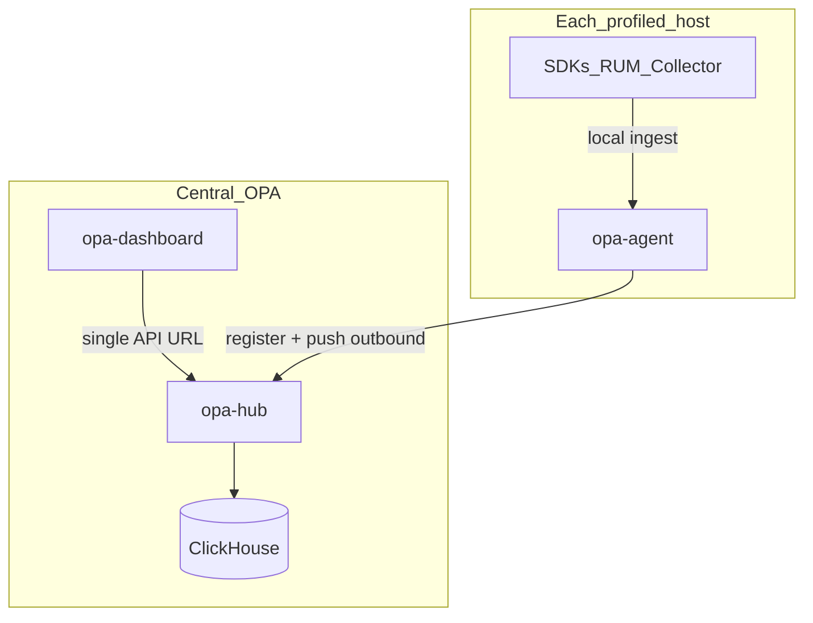

# Architecture

Open Profiling Agent uses a hub-and-spoke topology:

1. Language SDKs and collectors send telemetry to a local **edge** `opa-agent`.
2. Each edge agent **registers** and **pushes** telemetry outbound to **opa-hub**.
3. **opa-dashboard** uses one base URL and queries only the hub — never edge hosts.

## Containers

| Image | Role |
|-------|------|
| `opa-hub` | API / control plane |
