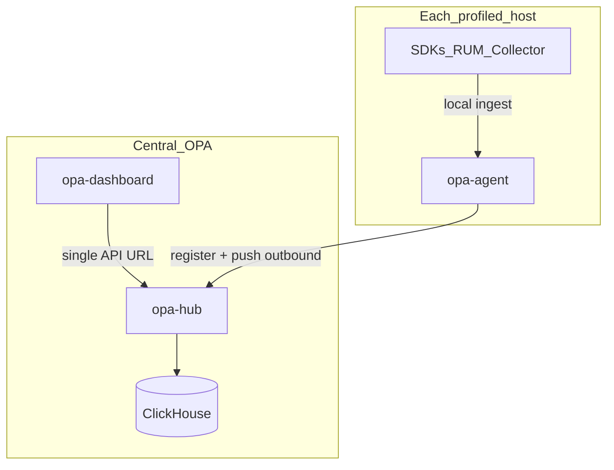

# Architecture

Open Profiling Agent uses a hub-and-spoke topology (push-primary):

1. Language SDKs and collectors send telemetry to a local **edge** `opa-agent`.
2. Each edge agent **registers** and **pushes** telemetry outbound to **opa-hub**.
3. **opa-dashboard** uses one base URL and queries only the hub — never edge hosts.

## Components

| Component | Image / binary | Responsibility |
|-----------|----------------|----------------|
| Edge agent | `opa-agent` | Local ingest; register + push; alert evaluation; synthetics probes; RUM ingest |
| Hub | `opa-hub` | Agent registry, ingest accept, query/admin API, auth issuer, alert + synthetics CRUD, central ClickHouse writes |
| Dashboard | `opa-dashboard` | Single UI URL → hub only |
| Storage | ClickHouse | Central telemetry store (via [Open-ClickHouse-Go](https://github.com/TheGrimmChester/Open-ClickHouse-Go)) |

See [ownership.md](ownership.md) for the hub vs edge writer/worker split.

## Traffic direction

- **Primary:** edge → hub (HTTPS egress). Agents need `OPA_HUB_URL` and an enroll token (`OPA_HUB_ENROLL_TOKEN` / `X-OPA-Enroll-Token`).
- Hub does **not** require inbound access to edge hosts for normal monitoring.
- Optional later: agent-initiated command channel (not required for this control plane).

## Hub packages

| Package | Role |
|---------|------|
| `internal/registry` | Agent register / heartbeat / list |
| `internal/ingest` | Edge push accept + ClickHouse write hooks |
| `internal/auth` | User JWT issuer for the dashboard (`/api/auth/*`) |
| `internal/query` | Dashboard query/admin API reading central ClickHouse (`services`, `traces`, …) |
| `internal/store` | ClickHouse writer + SELECT via Open-ClickHouse-Go |

## Containers

| Image | Role |
|-------|------|
| `opa-hub` | API / control plane |
| `opa-hub:smoke` | Laptop / CI only |
| `opa-hub:nas` | Production / NAS |
